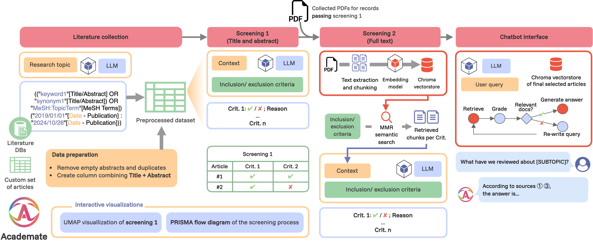
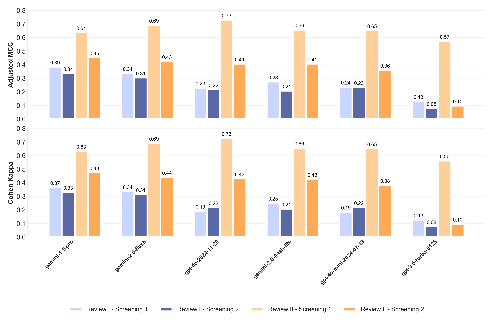

# Academate: AI-Powered Systematic Literature Review Framework

<div align="center">
  
  
  [](https://opensource.org/licenses/BSD-3-Clause)
  [](https://www.python.org/)
  [](https://apps.cosy.bio/academate)
</div>

## Overview

Academate is a comprehensive AI-powered framework designed to streamline the systematic literature review process. It addresses the challenges of information overload in scientific research by leveraging state-of-the-art large language models (LLMs) and embeddings to automate the labor-intensive steps of systematic reviews while keeping the human in the loop.

<div align="center">
  
</div>

## Key Features

- **End-to-End Review Support**: Automates all phases of a PRISMA-compliant systematic review
- **LLM-Powered Screening**: Two-stage literature screening (title/abstract and full-text)
- **Automated PDF Handling**: Downloads, processes, and analyzes PDF documents
- **Interactive Q&A Chatbot**: Extract insights from the final set of included articles
- **Visualizations**: PRISMA flow diagrams and topic visualizations
- **Flexible Architecture**: Modular design with support for multiple LLM providers
- **Human-in-the-Loop**: Maintain researcher oversight at all stages
- **Vector Database Integration**: Leverages Chroma for efficient text processing
- **Concurrent Processing**: Optimized for performance with large document sets

## System Architecture

Academate consists of four main modules that align with the systematic review workflow:

1. **Literature Identification**: Automated generation of database-specific search queries for PubMed, Semantic Scholar, and Scopus
2. **Screening 1 (Title & Abstract)**: LLM-driven evaluation of titles and abstracts against inclusion/exclusion criteria
3. **Screening 2 (Full Text)**: Automated PDF retrieval, text extraction, and semantic search for in-depth evaluation
4. **Data Extraction**: Interactive chatbot interface for querying the final selected articles


## Installation

### Python Package

```bash
# Clone the repository
git clone https://github.com/fmdelgado/academatepy
cd academate

# Install dependencies
pip install -r requirements.txt
```

### Main Dependencies

```
langchain-community
langchain
pandas
tqdm
chromadb
PDFPlumber
habanero
requests
nest_asyncio (for Jupyter notebooks)
xlsxwriter
plotly (for visualizations)
```

## Usage

### Basic Setup

```python
from academate import academate
import nest_asyncio  # If using Jupyter notebook

# Apply nest_asyncio if using Jupyter
nest_asyncio.apply()

# Initialize the academate instance
screening = academate(
    topic="Your research topic",
    llm=your_llm_model,  # e.g., ChatOpenAI(model="gpt-4o")
    embeddings=your_embeddings_model,  # e.g., OpenAIEmbeddings()
    criteria_dict=your_criteria,
    vector_store_path="path/to/store",
    literature_df=your_dataframe,
    content_column="Record",
    pdf_location="path/to/pdfs",
    verbose=False
)
```

### Define Inclusion/Exclusion Criteria
In Academate, criteria must be structured to instruct the LLM to evaluate whether the criterion is met and return a boolean value. This approach ensures systematic assessment and reproducibility.
Best Practices:

Structure each criterion with a clear, detailed description
Always format as conditional statements that return true/false
Be explicit about both inclusion (return true) and exclusion (return false) conditions
Use precise language to avoid ambiguity
Consider what information will be available at each screening stage

```
python
Copiarcriteria_dict = {
    "population": "If the study population includes humans with endometrial disorders (such as Asherman's syndrome, intrauterine adhesions, endometrial atrophy), then return true. Otherwise, return false.",
    
    "intervention": "If the study evaluates a regenerative therapy including cellular therapies (stem cells, MSCs) or acellular therapies (PRP, EVs), then return true. If the study exclusively evaluates pharmacological treatments without a regenerative component, then return false.",
    
    "outcome": "If the study reports outcomes related to endometrial regeneration, repair, or function (including endometrial thickness, menstrual changes, fertility outcomes), then return true. If the study only reports outcomes unrelated to endometrial regeneration, then return false.",
    
    "study_type": "If the article is an original peer-reviewed full-text article, then return true. If the article is a review, opinion piece, editorial, letter, or untranslated document, then return false."
}
```

This structured approach encourages researchers to think critically about the precise meaning and operationalization of each criterion, leading to more consistent and reproducible reviews.

### Run Screening Process

```python
# Run first screening (title/abstract)
results_screening1 = screening.run_screening1()

# Run second screening (full-text)
results_screening2 = screening.run_screening2()

# Generate PRISMA flow diagram
screening.create_prisma_flow_diagram()

# Create topic visualization
screening.create_topic_visualization()
```

### Interactive Chatbot for Data Extraction

```python
# Create and use the chatbot to query included articles
response = screening.chat("What are the main outcomes reported in studies using stem cells?")
```

## Performance Benchmarks

Academate has been evaluated on multiple systematic reviews across different domains, showing substantial agreement with human reviewers. Key findings from our evaluation:

- **LLM Performance**: Gemini models consistently demonstrated the highest performance, with gemini-1.5-pro achieving the highest mean adjusted Matthews Correlation Coefficient (0.453) and Cohen's Kappa (0.452)
- **Screening Stages**: Performance was generally higher in title/abstract screening compared to full-text screening
- **Domain Variation**: Performance varied across research domains, suggesting that certain fields may present unique challenges

<div align="center">
  
</div>

## Web Application

Academate is also available as a web application at [https://apps.cosy.bio/academate](https://apps.cosy.bio/academate).

The web interface provides:
- Intuitive setup of search terms and inclusion/exclusion criteria
- Real-time visualization of the screening process
- Interactive chatbot for querying included studies
- Export options for results and PRISMA diagrams

## Directory Structure

```
vector_store_path/
├── embeddings/
│   ├── screening1_embeddings/
│   └── screening2_embeddings/
├── screening1/
│   ├── screening1_predicted_criteria.pkl
│   └── screening1_missing_records.pkl
├── screening2/
│   ├── screening2_predicted_criteria.pkl
│   └── screening2_missing_records.pkl
└── pdfs/
    └── downloaded_pdfs/
```

## Tips for Optimal Use

1. **Define Clear Criteria**: Formulate precise inclusion/exclusion criteria
2. **API Keys**: Use valid API keys for optimal performance with external services
3. **PDF Management**: Ensure proper file permissions for PDF storage
4. **Memory Usage**: Monitor memory consumption when processing large collections
5. **Checkpointing**: Enable checkpointing for long-running processes

## Troubleshooting

1. **Event Loop Errors in Jupyter**:
   - Solution: Use `nest_asyncio.apply()`

2. **PDF Download Failures**:
   - Check DOI validity
   - Verify access permissions
   - Review error logs

3. **Memory Issues**:
   - Adjust batch sizes via the `batch_size` parameter
   - Monitor PDF chunk sizes
   - Use proper garbage collection

## Contributing

Contributions are welcome! Please follow these steps:
1. Fork the repository
2. Create a feature branch
3. Submit a pull request

## License

This project is licensed under the BSD 3-Clause License.

**License Terms:**
- Free for academic and non-profit use under the BSD 3-Clause License (https://opensource.org/license/BSD-3-Clause)
- Commercial users must contact the Cosy.Bio laboratory at University of Hamburg (https://cosy.bio) to obtain a commercial license

## Code Availability

- Python package: [https://github.com/fmdelgado/academatepy](https://github.com/fmdelgado/academatepy)
- Java version: [https://github.com/SimonSuewerUHH/academate4j](https://github.com/SimonSuewerUHH/academate4j)
- UI: [https://github.com/SimonSuewerUHH/academateUi](https://github.com/SimonSuewerUHH/academateUi)
- Web tool: [https://apps.cosy.bio/academate](https://apps.cosy.bio/academate)


## Contact

For inquiries or support, please contact:  
Fernando Miguel Delgado Chaves  
[fernando.miguel.delgado-chaves@uni-hamburg.de](mailto:fernando.miguel.delgado-chaves@uni-hamburg.de)